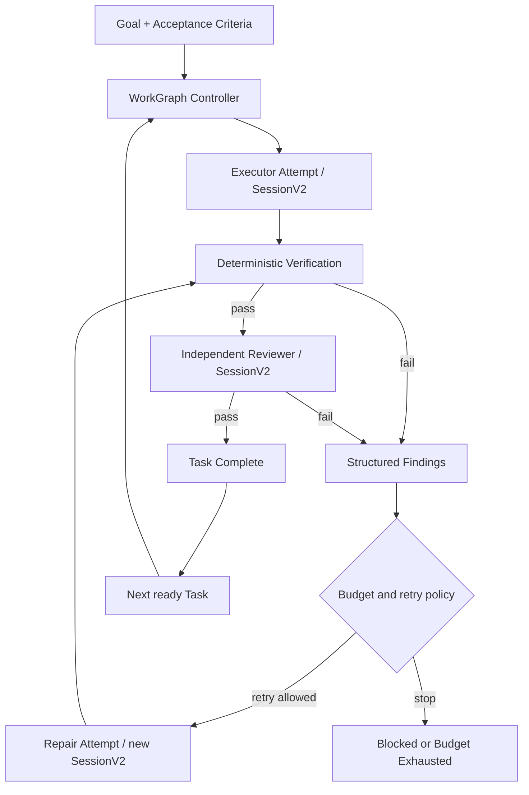

# WorkGraph V1 架构方案

状态：Implementing

日期：2026-08-07

实现进度（2026-08-07）：

- Phase 0 已完成：领域 Schema、36 个 durable events、SQLite 投影、状态机、迁移与重放约束已经落地。
- Phase 1 的首条纵向链路已完成：单 Task 会创建独立 SessionV2 Attempt，支持 durable admission、`pausing`/`cancelling` 中间态、pause/resume/cancel、基础 Attempt/repair 预算，并已接入桌面服务图和公开客户端。
- SessionV2 canonical `task` 子代理已完成前台与后台链路：独立 child Session、角色校验、父子所有权、权限、禁止无界嵌套、中断传播和结果回传已经落地；`task_status`、`task_list`、`task_cancel`、`task_resume` 与 admitted prompt 启动恢复均已接入。promoted 但结果未知的 provider work 仍坚持人工显式恢复，不做静默重放。
- V2 原生 MCP 已完成首条生产链路：stdio、Streamable HTTP/SSE fallback、动态 canonical ToolRegistry 注册、JSON Schema 暴露、Location 作用域、PermissionV2、超时、断线清理、资源/模板/prompt catalog、server instructions 的 System Context 注入和真实 stdio 集成测试已经落地。远程 OAuth 目前只会进入 `needs_auth`，V2 OAuth 完成 API 仍待迁移。
- Phase 2 已完成 command/test 与 workspace file verifier、Evidence/Evaluation、运行时完成权和有界自动 repair；merge diff 已接入内容寻址 Artifact，通用 Evidence Artifact 托管仍待扩展。
- Phase 3 的内核链路已完成：独立只读 Reviewer Session、严格结构化输出、review Evidence/Evaluation、repair Attempt、预算和 no-progress 失败签名均已接入；IDE 已增加 WorkGraph 控制面，展示 Task graph、Gauntlet Attempt、Evidence、Evaluation 和预算用量。
- Phase 4 已完成本地持久化 ownership 主链路：每个 Goal 通过 SQLite 原子 lease、heartbeat 和单调 fence 保证单 owner；旧 owner 失去 lease 后不能提交晚到结果。启动恢复会 advisory wake admitted Attempt；结果无法确认的 running Attempt 进入 unknown，用户可在 IDE 显式授权 retry，绝不自动重放未知副作用。provider/tool dispatch 的全部 crash-window 兼容矩阵仍需继续扩展。
- IDE 最小控制面已完成：用户可以在 `/work` 创建并启动 Goal、查看状态和证据、pause/resume/cancel，并处理 unknown Attempt；旧/新布局都可通过命令面板 `Open WorkGraph` 进入。
- 显式 resume 也可恢复因凭证或订阅等人工可修复问题而 blocked 的 Goal：Goal 重新进入 active，blocked Task 转入 rework，并从 durable Attempt/Session 状态继续；非重试型鉴权错误不会形成后台模型调用循环。
- Phase 5A 已完成首条生产纵向链路：只读 `work-planner` 通过独立 Planner Attempt 生成结构化 DAG，运行时校验 Task key、角色、criterion 覆盖、依赖引用和无环性后，以单个 `TaskGraphPlanned` durable event 原子投影。调度器支持 `maxParallelTasks` 有界并行；clean Git 工作区可为独立写 Task 创建 worktree，dirty/non-Git 工作区保守回退共享串行执行。隔离结果通过 durable merge input、`git apply --check`/反向检查和 merge/conflict 事件可恢复地合并，冲突不会覆盖主工作区。IDE 已改为 Work 事件驱动刷新，并可从 Attempt 下钻到独立 Session。
- Phase 5B 的首条纵向链路已完成：`TaskGraphExpanded` 支持 active/paused Goal 以稳定 Task ID 原子追加 DAG 片段并精确重试，完整图会重新校验依赖、criterion、总量和无环性；IDE 可追加带依赖的 follow-up Task。超过 64 KiB 的 merge diff 使用 SHA-256 内容寻址 Artifact，读取时复核引用、大小和摘要，事件流不再承载大补丁。成功或冲突合并会安全回收 linked worktree；取消时先以 `TaskIsolationArchived` 保存修改再回收，归档失败则保留目录。内部 runtime 角色禁止由外部扩图注入，explore 角色保持只读且不能申请写隔离。Task 删除/重连、Artifact GC/远程后端仍属于后续演进。
- Phase 5C 的纵向链路已完成：新增独立、隐藏、只读的 `work-architect` Agent 和 `replan` Attempt。人工 replan 会通过一个 `GoalReplanRequested` durable event 原子激活 Goal 并创建 Architect Task；重复 verifier/reviewer 失败在显式 `maxReplans` 预算内也可自动升级。Architect 只提出结构化恢复图，runtime 校验 blocked Task、criterion 继承、依赖、角色、隔离、Task 上限和无环性，再由单个 `TaskGraphReplanned` 事件原子地把旧 Task 标记为 `superseded` 并插入替代 DAG。被替代 worktree 会先归档再回收；已提交恢复图但 Architect Task 尚未完成的 crash window 可重启 reconcile。IDE、HTTP API 和 SDK 已加入 `Architect Replan` 控制入口。
- Phase 6A 的首条纵向链路已完成：执行 Agent 在原 provider run 末尾提交严格的 `HandoffOutput`，runtime 将其解析、限长、绑定成功 Attempt 与通过验证的 Evidence，并通过 `TaskHandoffRecorded` durable event 投影到独立 mailbox。后续 Executor、Reviewer 和 Architect 只消费结构化 Handoff，不再直接读取上游聊天记录；旧任务输出可在重启后确定性补录。已验证 Handoff 同时作为 Location 级 Project Memory 的事实来源，经 System Context/Context Epoch 注入后续 Session。HTTP、SDK 和 IDE 已公开 Handoff、内容摘要与 digest。
- Phase 6B 已完成首条 Agent Organization 纵向链路：`pm`、`architect`、`developer`、`qa`、`security` 与兼容角色拥有公开 `RoleContract`，运行时把角色映射到独立隐藏 Agent，并强制执行读写权限、隔离能力、可发布/可消费 Handoff 类型；WorkGraph 专用 Agent 不得自行绕过控制器委派子 Agent。Handoff 通过 `TaskHandoffRouted` durable event 定向投递到直接下游 Task，扩图或重启后可补齐路由，Task 在依赖 Handoff 到达前不会启动。Project Memory 只接纳显式 `memory=project` 且有稳定 key 的条目，支持同值去重、冲突显式化和 epoch-millisecond 过期时间，不再把全部聊天结果自动当成长期记忆。HTTP、SDK 与 IDE 已公开角色契约、收件人和记忆元数据。
- Phase 6C 已完成可配置 Agent Organization 与记忆治理纵向链路：`zaovra.json/jsonc` 可声明组织 Role Contracts，并通过配置 Agent ID 绑定自定义 Agent；新 Goal 会冻结完整 Role Contract 快照，后续配置变化不改写历史执行或重放语义，引用不存在 Agent 的组织配置会在创建入口被拒绝。Project Memory 冲突可在 IDE 中选择精确候选，`ProjectMemoryResolved` durable event 绑定 Handoff digest、item digest、裁决人、理由与时间，投影保留不可变审计记录；过期、跨项目或内容漂移的候选无法被裁决。HTTP、SDK 与 WorkGraph 控制面已经公开组织快照、记忆视图和裁决入口。跨设备执行 ownership 与集群调度仍作为下一条独立主线。
- Phase 7A 已完成分布式 ownership 的安全地基：Worker 通过持久化 heartbeat 暴露身份、能力、工作区根目录和 draining 状态；Goal placement 由 durable event 审计，lease 同时绑定 Worker ID、进程 owner 与单调 fence。运行中的 lease 禁止迁移，过期 Worker 会变为 offline，错误 Worker 无法取得或续租。HTTP、SDK 与 IDE 已提供 Worker 池、执行位置、租约详情和安全迁移控制。当前尚未实现远程 Worker 的认证拉取、模型/工具执行传输、Artifact 同步和跨设备 Location 映射，因此 7A 是可验证的调度边界，不等同于远程执行已经完成。
- Phase 7B 已完成同机独立 Worker 的生产纵向链路：控制器可签发、轮换和撤销一次性 Worker 凭证，数据库只保存绑定 Worker ID 的 SHA-256 摘要，认证比较使用恒定时间；Worker 通过认证 poll heartbeat 并只拉取 placement 指定的 Goal。`zaovra worker enroll/start` 可启动独立进程，复用 SessionV2、WorkGraph、lease 与 recovery，并在共享 SQLite/WAL 和工作区前提下真实取得 Worker/owner/fence 租约。draining、offline、无 execute 能力或凭证失效的 Worker 不能取得新 lease，运行中的合法租约仍可在安全边界结算。跨设备数据库、Event、Artifact、Location 与日志复制仍属于 7C，当前不宣称生产级跨设备执行。
- Phase 7C-A 已完成首条无共享数据库的跨设备执行纵向链路：控制器继续拥有 Goal、Attempt、Evidence、Evaluation 与 Goal lease 的唯一真相，并通过独立的 durable Worker Job 队列把 command/file verifier 下发给 `remote` Worker；Worker 使用显式 Location 映射在本机执行，通过独立 job lease 与单调 fence 续租和提交结果。过期租约进入 `unknown`，不静默重放可能已有副作用的命令；相同完成结果可精确重试，冲突结果、错误 fence、超大结果和类型错配会被拒绝。远程模式禁止共享数据库，非本机控制器必须使用 HTTPS。
- Phase 7C-B 已完成跨设备受管输出纵向链路：远程 Job 以严格递增 sequence 和 job fence 追加有界结构化日志；Git patch 只允许在控制器冻结的相同 HEAD 与干净 Worker 工作区上捕获，内容、字节数和 SHA-256 经控制器复核后进入内容寻址 Artifact 存储。Job 完成只能引用同一 Worker、同一 fence 已登记的 Artifact，乱序/冲突日志、错误摘要、超限内容和未登记引用均被拒绝；HTTP、SDK 与 IDE 已公开 Job 状态、最后日志、Artifact 摘要和受校验内容读取。7C-B 的范围止于 command/file 与 Git patch 传输，完整 Agent provider/tool 主循环由后续 7C-C1 承接。
- Phase 7C-C1 已完成完整远程 Agent Attempt 的第一条纵向链路：控制器把已 admitted Attempt、Agent 身份、完整 Task prompt、固定 Git HEAD 和上一轮累计 patch 摘要封装为 fenced Agent Job；远程 Worker 使用自己隔离的持久化数据库运行原生 SessionV2 provider/tool 循环，因此沿用同一套模型解析、ToolRegistry、MCP、权限、Context Epoch 和 durable transcript，而不是另建内存 tool loop。Worker 实时上报 Agent step/tool/text 日志，最终响应和累计 workspace patch 分别由 SHA-256 绑定；控制器只在确定性 verifier/reviewer 全部通过后同步最终 patch，发现本地漂移时拒绝覆盖。WorkGraph 专用 Agent 权限已经收口为无人值守的 allow/deny，问题工具、外部目录和敏感环境文件不会形成无法回答的远程等待。
- Phase 7C-C2 已完成单控制器远程运行时加固：Worker 注册并公开 1–32 个并发槽位，控制器按活动租约计数实施背压，Worker 把每个 Job 放入独立 Fiber 后持续 poll，不再因一个长 Agent 阻塞取消和新任务。每次启动具有独立 `WorkerRuntimeID`，Job 续租、日志、Artifact 与完成均同时校验 Worker、runtime、fence；旧进程不能用同一凭证覆盖仍在线的新旧运行实例。Goal/Attempt 中断会持久化为 `cancelling` 并下发到持有 Fiber，只有明确的 interrupted 结果可确认取消，失联仍进入 unknown。临时网络故障不会立即杀死本地 Session；执行结果先进入 Worker 本地 durable outbox，再上传结算，因此进程重启只会重绑定 `result_ready`，崩溃在 provider/tool 执行中的记录仍保守 unknown、等待人工裁决，绝不重放副作用。多控制器共识 ownership 仍属于后续 Phase 7D。
- Phase 7D 已完成共享持久化控制面的集群纵向链路：每个控制器拥有稳定 `ControllerID`、启动级 `ControllerRuntimeID`、heartbeat、draining 与失联状态；Goal lease 同时绑定控制器、runtime、Worker、owner 和单调 fence。所有 wake/interrupt 进入按 Goal 合并的 durable dispatch 队列，活动 Goal 的信号只由当前 lease 控制器领取，控制器失联且 lease/dispatch 过期后其他节点才可用更高 fence 接管。队列 revision 在执行期间继续递增，旧 revision 结算不会吞掉新信号；旧控制器不能续租、确认或覆盖新 owner。接管会先运行目标级 recovery：已持久完成的远程 Agent 结果可继续进入 verification，provider/tool 结果未知仍进入 unknown，绝不自动重放。Artifact 已加入持久 inventory、owner reference、访问时间、dry-run 回收和仅清理无引用内容的 GC 边界；HTTP、SDK 与 IDE 已公开 Controller、dispatch 和 Artifact 生命周期状态。该实现以所有控制器访问同一强一致数据库为前提，不把 SQLite 文件复制或网络文件共享伪装成跨地域共识。

以上状态表示当前已具备可运行的持久化 WorkGraph 内核切片，不表示 V1 全部退出标准已经满足。

## 1. 结论

ZAOVRA 不应把 `Session` 继续扩展成 Goal、任务队列、工作流和多 Agent 编排器。V1 应在现有 SessionV2 外层增加一个持久化的 `WorkGraph`：

- SessionV2 继续负责一次 Agent 执行的上下文、模型调用、工具调用、权限和可重放记录。
- WorkGraph 负责 Goal、Task、Attempt、Evidence、Evaluation、预算、恢复和循环控制。
- 一个执行或评审 Agent 对应一个独立 Session；Session 完成不等于 Task 完成。
- Task 只有在验收标准被证据满足后，才能由运行时状态机标记为完成。
- 失败后的修复创建新 Attempt，不能用对话文本假装“任务已经恢复”。

目标形态如下：



这不是一个更大的 `while (tool_call)`。它是一个可持久化、可观察、可恢复、可验证的外层控制平面。

### 1.1 产品基线：Codex 执行效果 + LangGraph 长任务效果

本方案的目标是行为等价，不要求源码结构、编程语言或公开 API 与 Codex、LangGraph 相同。

ZAOVRA 的内层执行器必须达到 Codex 类能力：

- 持久化 Thread/Session 和可重放 turn 历史；
- 一次明确的 provider turn、结构化工具调用和可靠结算；
- steering、queue、interrupt、resume 和上下文 compaction；
- Location、工作区、权限、审批、sandbox 和输出限制；
- 内置工具、MCP 工具和子 Agent 使用统一的模型可见工具协议；
- 子 Agent 拥有独立身份、上下文、角色、权限、取消和结果回传；
- 失败不能悄悄吞掉，未知副作用不能静默重放。

ZAOVRA 的外层控制器必须达到 LangGraph 类长任务能力：

- 每个状态迁移都有 durable checkpoint；
- 进程退出后从最后一个安全 checkpoint 恢复；
- 已成功节点的结果可以复用，恢复时不重复执行；
- retry policy、超时、预算和错误路由是结构化配置；
- interrupt/resume 和 human-in-the-loop 是一等状态；
- Task、子图、条件边和有限并行；
- 可查询当前状态、下一节点和完整状态历史；
- 节点副作用具有幂等、reconcile 或人工裁决策略。

V1 不以“我们实现了一个 Goal 表”作为完成标准，而以这两组行为的自动化兼容测试作为完成标准。

### 1.2 保留、迁移与重写决策

当前决定是：

- 保留并完成 SessionV2，不把整个应用替换成 Codex Rust 进程。
- 参考 Codex 的 agent loop、MCP、子 Agent、权限和中断测试，把缺失语义迁入 ZAOVRA 的 Effect/TypeScript 边界。
- 新写 WorkGraph 控制器，复用 EventV2，不直接嵌入 LangGraph Python runtime。
- 参考 LangGraph 的 checkpoint、task result、interrupt、retry、subgraph 和 pending-write 语义建立兼容测试。
- 将现有 legacy MCP adapter 迁入 V2 canonical ToolRegistry；成熟的连接、OAuth、资源和 catalog 代码继续使用。
- 将前台子 Agent 迁为 WorkGraph Attempt；实验性 BackgroundJob 不承担生产级长任务恢复。

选择“语义迁移 + 外层重写”而不是同时运行两个完整内核，是为了避免两套 Session、两套 checkpoint、两套权限和两套恢复真相。若某段 Codex 或 LangGraph 开源实现可以在许可证和语言边界内直接复用，可以直接采用，不以自研为目标。

## 2. 为什么要建立独立 WorkGraph

当前 SessionV2 已经有正确的执行内核方向：持久化输入、串行 Session drain、安全边界、明确的一次 `llm.stream(request)`、工具结算、上下文纪元和压缩。它适合回答“这个 Agent 的下一轮如何可靠执行”。

长任务还需要回答另一组问题：

- 整体目标是什么，什么结果才算完成？
- 当前执行到哪个 Task、哪个 Attempt？
- 进程退出后应该从哪里继续？
- 哪些外部副作用已经发生，哪些结果仍然不确定？
- 谁执行、谁验证、谁有权宣布完成？
- 连续失败多少次后应该停止，而不是无限消耗 token？

把这些问题塞进 Session 会混淆“对话记录”和“工作状态”，最终又退化为由模型从聊天历史猜测进度。WorkGraph 必须拥有独立的结构化状态和完成权限。

## 3. V1 目标与非目标

### 3.1 目标

V1 必须做到：

1. Goal、Task、Attempt 和验收证据持久化。
2. 进程重启后能发现未完成工作，并根据明确策略恢复、重试或等待人工裁决。
3. 支持 `执行 -> 确定性验证 -> 独立评审 -> 修复` 的有界 Gauntlet Loop。
4. 支持暂停、继续、取消、预算终止和可观察的失败原因。
5. 每个 Agent 角色拥有独立 Session、权限和 Location。
6. 保持 SessionV2、工具注册、权限和 Location 的现有边界。
7. 为后续 DAG、多 Agent 并行和项目记忆留出稳定扩展点。

### 3.2 非目标

V1 不做：

- 不引入第三方工作流运行时作为核心数据所有者。
- 不复制 LangGraph 的全部 API 或 checkpoint 格式。
- 不允许 Planner Agent 绕过 runtime graph validation、预算、权限和 durable mutation 直接拥有任务状态。
- 不把隐藏推理、模型内部状态或整个进程内存作为 checkpoint。
- 不承诺跨机器调度；但状态和 fencing 语义不能阻碍未来集群化。
- 不让模型仅凭一句“测试通过”直接完成 Task。
- 不把现有实验性 BackgroundJob 当作持久化任务系统。

第一版允许用户、产品层或固定模板直接创建 Task。以后 Planner 只负责提出或修改任务图，运行时仍负责验证和状态迁移。

## 4. 核心领域模型

### 4.1 Goal

Goal 是一项用户可感知工作的持久化根聚合。

最小字段：

| 字段                        | 语义                                            |
| --------------------------- | ----------------------------------------------- |
| `id`                        | 稳定 Goal ID                                    |
| `location`                  | 项目和工作区放置位置                            |
| `objective`                 | 用户目标，不是执行 prompt                       |
| `acceptance_criteria`       | 带稳定 ID 的结构化验收标准                      |
| `status`                    | Goal 状态                                       |
| `budget`                    | turn、token、费用、时间、Attempt 和返修次数限制 |
| `created_at` / `updated_at` | 生命周期时间                                    |
| `revision`                  | 乐观并发和迁移 fencing                          |

每条验收标准至少包含：

- 稳定 `criterion_id`；
- 人类可读描述；
- `required`；
- 证据类型，例如 command、artifact、diff、review 或 manual；
- 可选的确定性验证配置。

### 4.2 Task

Task 是可调度、可验收的工作单元。V1 可以只创建一个 Task，但数据模型从一开始支持依赖关系。

最小字段：

| 字段                     | 语义                                |
| ------------------------ | ----------------------------------- |
| `id` / `goal_id`         | Task 身份和所属 Goal                |
| `title` / `instructions` | 工作说明                            |
| `depends_on`             | 前置 Task ID 集合                   |
| `role`                   | executor、reviewer 或未来自定义角色 |
| `location`               | 实际执行 Location；可继承 Goal      |
| `status`                 | Task 状态                           |
| `attempt_count`          | 已创建 Attempt 数量                 |
| `criteria`               | 该 Task 负责满足的 Goal criteria    |
| `revision`               | 状态迁移 fencing                    |

Task 依赖只能在前置 Task 完成后进入 `ready`。Task 图必须保持无环；V1 可先限制为单 Task 或线性序列，后续再开放通用 DAG 编辑。

### 4.3 Attempt

Attempt 表示一次有身份的执行、修复或评审尝试。它是恢复和幂等判断的基本单位。

最小字段：

| 字段                      | 语义                            |
| ------------------------- | ------------------------------- |
| `id` / `task_id`          | Attempt 身份和所属 Task         |
| `kind`                    | execute、repair、review、verify |
| `number`                  | 同类 Attempt 的单调序号         |
| `session_id`              | 执行该 Attempt 的 SessionV2     |
| `status`                  | Attempt 状态                    |
| `owner_id` / `fence`      | 当前执行所有者及 fencing token  |
| `started_at` / `ended_at` | 时间                            |
| `failure`                 | 结构化失败或不确定结果          |
| `input_revision`          | 启动时看到的 Goal/Task 版本     |

同一个 Attempt 内可以在 SessionV2 的安全边界继续对话。新的返修循环必须创建新的 Attempt；默认也创建新的 Session，以免评审意见、旧工具状态和错误假设污染新的执行边界。

### 4.4 Evidence

Evidence 是不可变的事实记录，不是模型的自我评价。

建议的证据类型：

- `command`：命令、退出码、受限输出摘要和完整输出引用；
- `test`：测试套件、通过/失败数量和日志引用；
- `diff`：基线、当前 revision、文件列表和摘要；
- `artifact`：文件路径、内容摘要、hash、MIME 和大小；
- `review`：Reviewer 的结构化结论；
- `manual`：用户确认，必须记录确认者和时间；
- `external`：CI、MCP 或其他系统的稳定结果引用。

证据至少绑定 Goal、Task、Attempt、criterion、产生者、时间和内容 hash。大输出进入受管存储，事件只持久化摘要和不透明引用。

### 4.5 Evaluation

Evaluation 将 Evidence 映射到验收标准，输出 `pass`、`fail` 或 `blocked`。它必须包含：

- criterion ID；
- 使用的 Evidence ID；
- verdict；
- 结构化 findings；
- evaluator 类型和版本；
- 是否允许自动返修。

确定性 evaluator 优先于 LLM reviewer。LLM reviewer 不能覆盖失败的必选确定性检查。

## 5. 状态机

### 5.1 Goal 状态

```text
draft -> active -> completed
          |  |  \
          |  |   -> blocked
          |  -> budget_exhausted
          -> paused -> active
          -> cancelled
```

只有当所有 required criteria 都存在最新且有效的 `pass` Evaluation，并且所有 required Task 完成时，控制器才能提交 `completed`。

### 5.2 Task 状态

```text
pending -> ready -> running -> verifying -> reviewing -> completed
                    |          |            |
                    |          |            -> rework -> running
                    |          -> rework -> running
                    -> rework -> running

any non-terminal -> blocked | cancelled
```

`running` 只表示执行 Attempt 在工作。Session 结束、模型输出 final、工具调用成功，都不能直接跳到 `completed`。

### 5.3 Attempt 状态

```text
admitted -> running -> succeeded | failed | interrupted | unknown | cancelled
```

- `interrupted`：已知执行被中断，没有需要裁决的未知副作用。
- `unknown`：进程或连接在外部调用期间丢失，无法证明调用未发生或已完成。
- `succeeded`：该 Attempt 自身正常结束，不代表 Task 已验收。

终态 Attempt 不复活。继续工作需要创建新 Attempt；只有同一进程内尚未结束的 Session drain 可以被加入或 steering。

## 6. 运行时边界

### 6.1 服务职责

建议的 Core 服务：

- `WorkStore`：进程全局的持久化读写模型和事件发布。
- `WorkExecution`：进程全局、Goal ID 驱动的协调器；合并重复 wake，串行同一 Goal 的控制迁移，允许不同 Goal 并行。
- `WorkRunner`：Location scoped；解析 Agent、模型、工具、验证器和工作目录。
- `WorkRecovery`：显式扫描可恢复工作，处理过期 owner 和未知结果；不能把 advisory wake 当成 crash recovery。
- `EvaluatorRegistry`：注册确定性验证器和 reviewer policy。

这与 SessionV2 的边界保持一致：全局服务根据持久化 Location 查找对应的 Location-scoped runner。任何 Location layer 都不接收 Goal ID 或 Session ID。

### 6.2 WorkGraph 与 SessionV2 的契约

WorkGraph 不直接调用模型，也不执行普通工具。一次 executor 或 reviewer Attempt 的流程是：

1. 持久化创建 Attempt 和 SessionV2 身份。
2. 使用稳定 prompt message ID 调用 `SessionV2.prompt(...)`，先完成 durable admission。
3. advisory wake 触发 Session execution。
4. 等待 Session 的耐久事件或显式终态，不依赖进程内回调作为唯一事实来源。
5. 从持久化 transcript、diff 和工具结果生成 Evidence。
6. WorkGraph 提交下一状态迁移。

必须保留 SessionV2 的现有不变量：

- durable prompt admission 与模型执行分离；
- 每个 provider turn 只有一次显式 `llm.stream(request)`；
- continuation 前重新加载投影历史；
- 重启后遗留 `running` 工具被标记中断，不静默重放；
- SessionExecution 保持 Session-ID based 和 process-global；
- SessionRunner、模型、权限、工具和文件系统保持 Location scoped。

WorkGraph 不能通过 legacy `SessionPrompt.loop(...)`、legacy `task` 工具或 BackgroundJob 间接取得持久化语义。

### 6.3 Checkpoint 的定义

V1 checkpoint 不是模型内存快照。每个持久化状态迁移就是 checkpoint，至少包含：

- 当前 Goal/Task/Attempt 状态；
- 所有已提交 Evidence 和 Evaluation；
- 当前预算计数；
- Session ID 和可重放事件 cursor；
- owner、lease、fence 和恢复决策；
- 下一合法节点。

外部调用期间不持有数据库事务。调用前先持久化 Attempt/dispatch 边界，调用后再持久化结果或未知状态。

## 7. 执行节点契约

每个 WorkGraph 节点必须声明：

- 输入状态和允许的前置状态；
- 可能的下一状态；
- 是否产生外部副作用；
- replay 分类；
- budget 消耗；
- 超时与错误分类；
- 产生的 Evidence/Evaluation 类型。

Replay 分类：

| 分类             | 语义                         | 恢复策略                       |
| ---------------- | ---------------------------- | ------------------------------ |
| `pure`           | 只读取持久化状态             | 可安全重算                     |
| `idempotent`     | 使用稳定幂等键               | 可有界重试                     |
| `reconcilable`   | 可查询外部系统确认结果       | 先 reconcile，再决定           |
| `non_replayable` | 结果无法确认且可能产生副作用 | 标记 unknown，等待人工或新策略 |

节点使用 `expected_revision + fence` 提交结果。旧 owner 即使晚到，也不能覆盖新 owner 已提交的状态。

## 8. Gauntlet Loop

V1 的默认循环为：

```text
execute/repair
  -> collect evidence
  -> deterministic verification
  -> independent review
  -> complete or structured findings
  -> budget/no-progress decision
  -> next repair attempt or stop
```

### 8.1 确定性验证

优先执行可重复的检查，例如：

- 指定测试命令和 typecheck；
- lint、格式或生成文件一致性；
- 文件、schema、API 或 artifact 存在性；
- diff 范围和禁止路径；
- 构建结果或可启动性；
- 用户为某个 Goal 配置的自定义 verifier。

验证器必须记录实际命令、Location、退出码和输出引用。Agent 自述“已运行测试”不能替代运行时证据。

### 8.2 独立 Reviewer

Reviewer 使用独立 Session 和默认只读权限。输入包括：

- Goal、Task 和 acceptance criteria；
- 基线与当前 diff；
- 确定性验证证据；
- 必要的项目上下文；
- 上一轮未解决 findings。

Reviewer 不需要 executor 的隐藏推理，也不应继承 executor 的完整对话。Reviewer 输出必须解析成 schema：criterion verdict、severity、file/location、finding、建议和置信度。

### 8.3 修复和停止

进入下一次 repair 前必须满足：

- 至少一个可操作 finding；
- 仍有 Attempt、turn、token、费用和时间预算；
- 未触发相同失败签名的 no-progress 阈值；
- Goal 未被暂停、取消或用户 steering 改变。

默认建议：

- 同一 Task 最多 3 次自动 repair；
- 同一失败签名连续出现 2 次则停止自动循环；
- reviewer 只指出意见但没有新证据时，不无限重试；
- 安全、权限或未知外部副作用问题直接进入 `blocked`。

阈值必须配置化并在 UI 可见，不能藏在 prompt 中。

## 9. 恢复、暂停与中断

### 9.1 正常中断

暂停 Goal 时：

1. 持久化 `pause_requested`。
2. 阻止创建新 Attempt。
3. 在 Session 安全边界中断当前本地执行。
4. 结算 Attempt 为 `interrupted` 或 `unknown`。
5. 持久化 Goal 为 `paused`。

取消还需要取消未开始 Task，但保留全部历史、Evidence 和产物。取消不是删除。

### 9.2 进程重启

启动恢复不能简单调用 `SessionExecution.wake(sessionID)`。WorkRecovery 应：

1. 查找非终态 Goal、过期 owner 和运行中 Attempt。
2. 检查最后持久化 dispatch 边界和 Session/tool 事件。
3. 对 pure/idempotent/reconcilable 节点执行相应恢复策略。
4. 对无法证明结果的外部调用提交 `unknown`。
5. 在预算允许时创建新的 Attempt，或将 Goal 标为 blocked 等待用户。

模型 provider 请求如果已经发出但没有耐久结果，默认不得自动重发。工具副作用同样不得因为“看起来没完成”而静默重放。

### 9.3 本地所有权

第一版仍可只在单机执行，但每个运行中 Attempt 都应具有短 lease 和单调 fence。Process-local coordinator 用来降低重复工作，持久化 owner/fence 才是崩溃后裁决依据。

这不是提前实现集群，而是避免单机恢复逻辑将来无法安全扩展。

## 10. 多 Agent、权限与工作区隔离

V1 角色至少包含：

- `executor`：允许完成目标所需的编辑和工具；
- `reviewer`：默认只读，可运行安全的验证命令，不可编辑；
- `repairer`：可复用 executor agent 配置，但拥有新的 Attempt 和 Session。

未来 Planner、Architect、QA、Security 只是新的 role policy 和节点，不应要求重写 Session 内核。

每个 Attempt 明确绑定：

- Agent 配置版本；
- 模型选择；
- Location；
- permission ruleset；
- tool capability policy；
- 可选 worktree/branch；
- 输入 context revision。

不同写入型 Attempt 默认不能并发修改同一个工作区。开放并行写入前，必须提供隔离 worktree、合并节点和冲突处理。只读 reviewer 可以与已冻结 revision 并行。

现有 `parentID` child Session 可以继续用于 UI 展示关系，但它不是任务所有权、依赖、完成或恢复的事实来源。

## 11. MCP 和工具边界

MCP 是 Session 的工具、资源和 prompt 来源，不是 WorkGraph 节点状态存储。

- WorkGraph 决定某个 Attempt 允许哪些 capability。
- Location-scoped ToolRegistry 将 MCP 工具物化为 canonical Tool。
- 叶子工具执行自己的权限检查、超时和输出边界。
- MCP 调用产生的稳定结果可以被记录为 Evidence。
- MCP server 断开、OAuth 需求或超时属于 Attempt failure；不能让整个 WorkGraph 状态丢失。
- MCP protocol 的 experimental task capability 不能替代 ZAOVRA 的 Goal/Task/Attempt 模型。

在 V2 MCP canonical registration 完成前，WorkGraph 不应依赖 legacy MCP adapter 执行首个生产级自动循环。

## 12. 事件和投影

建议以 Goal ID 作为 WorkGraph 聚合 ID，并通过 EventV2 发布版本化事件。

首批事件：

```text
work.goal.created.1
work.goal.activated.1
work.goal.pause-requested.1
work.goal.paused.1
work.goal.cancel-requested.1
work.goal.completed.1
work.goal.blocked.1
work.goal.cancelled.1
work.goal.budget-exhausted.1

work.task.created.1
work.task.readied.1
work.task.started.1
work.task.verification-started.1
work.task.review-started.1
work.task.rework-requested.1
work.task.completed.1
work.task.blocked.1

work.attempt.admitted.1
work.attempt.started.1
work.attempt.settled.1
work.evidence.recorded.1
work.evaluation.recorded.1
work.ownership.claimed.1
work.ownership.released.1
```

投影表建议为：

- `work_goal`
- `work_task`
- `work_task_dependency`
- `work_attempt`
- `work_evidence`
- `work_evaluation`

所有状态迁移和关键 Evidence 引用必须 durable。token 流、日志增量和模型 reasoning delta 可以 live-only，但不能推进 durable cursor，也不能作为完成依据。

事件 projector 在同一事务内更新状态投影、revision、预算和 inbox/wake 所需标记。禁止先更新表、再尽力发布事件的双写模式。

## 13. API 草案

Core facade 第一版建议提供：

```ts
work.create({ id?, location, objective, acceptanceCriteria, budget?, tasks? })
work.get(goalID)
work.list({ location?, status?, cursor? })
work.events({ goalID, after? })
work.pause(goalID)
work.resume(goalID)
work.cancel(goalID)
work.retry({ goalID, taskID, reason? })
work.resolveUnknown({ goalID, attemptID, resolution, evidence? })
```

内部执行接口：

```ts
WorkExecution.wake(goalID)
WorkRecovery.scan()
WorkRunner.run(goalID)
```

`wake` 只是 advisory signal，重复 wake 合并。`resume` 是用户明确要求继续；它不能绕过未知副作用、权限、预算或验收状态。

包依赖保持：

```text
Schema -> Core / Protocol -> Server
Client -> Schema / Protocol
sdk-next -> Client + Core + Server
```

公开 Protocol 或 Server HttpApi 变更后，必须从 `packages/client` 运行 `bun run generate`；不能直接编辑 generated 目录。

## 14. 可观察性

UI 和日志至少需要展示：

- Goal 总状态和未满足 criteria；
- Task DAG/线性进度；
- 当前角色、Attempt 和 Session；
- 执行、验证、评审、返修所处阶段；
- Evidence 和 Evaluation；
- 已用/剩余预算；
- pause/cancel 请求是否已到达安全边界；
- crash recovery、unknown 和人工裁决原因；
- 每次状态迁移的 durable sequence。

用户看到的“正在工作”必须来自持久化 Attempt 状态；不能只来自一个前端 loading 状态或进程内 BackgroundJob map。

## 15. 实施分期

工期取决于团队规模，下面按 2 至 3 名熟悉 Core 的工程师估算为 9 至 12 个工程周。

### Phase 0：不变量和 Schema（约 1 周）

- 确认本方案和状态机。
- 定义 Goal/Task/Attempt/Evidence/Evaluation schema、ID 和事件。
- 加入迁移和 projector 测试。
- 不接模型，不做 UI 大改。

退出标准：事件可重放得到完全相同的 WorkGraph 投影。

### Phase 1：单 Task 持久化执行（约 2 周）

- 实现 WorkStore、WorkExecution 和 Location-scoped WorkRunner。
- 创建 executor SessionV2，durably admit prompt，并观察终态。
- 支持 pause、resume、cancel 和基础预算。
- 暂不自动评审或返修。

退出标准：进程在执行前、admission 后和 Session 结束后三个位置退出，均不会丢 Goal，也不会重复完成 Task。

### Phase 2：Evidence 和确定性验证（约 2 周）

- 实现 command/test/diff/artifact Evidence。
- 实现 verifier registry 和 criterion evaluation。
- Task 完成权从 Agent 移到控制器。

退出标准：模型声称成功但测试失败时，Task 必须保持未完成并产生可读 finding。

### Phase 3：独立评审与返修循环（约 2 至 3 周）

- 创建只读 reviewer Session。
- 结构化 reviewer output。
- repair Attempt、预算、no-progress 和失败签名。
- UI 显示 Gauntlet 阶段和返修原因。

退出标准：一个故意引入的小错误能被 verifier/reviewer 发现、返修并再次验收；超过预算会稳定停止。

### Phase 4：显式恢复和所有权（约 2 周）

- owner lease、fence、startup scan 和 unknown resolution。
- 覆盖 provider dispatch、工具副作用和重启窗口。
- 增加恢复 UI 和人工裁决 API。

退出标准：对每个 crash window 都有确定的状态，不自动重放不安全副作用，旧 owner 无法晚到覆盖新状态。

### Phase 5：Task DAG 与隔离并行（约 2 周）

- 依赖调度、只读并行和 worktree 隔离。
- 合并/冲突节点。
- Planner 只通过受验证的 graph mutation API 提议任务图。

退出标准：两个独立 Task 可并行，依赖 Task 不会提前启动，写冲突不会悄悄覆盖。

当前状态：Phase 5A 至 5C 的核心退出标准已由自动化测试覆盖，包括安全的 additive graph mutation、内容寻址 merge Artifact、隔离目录生命周期和有界 Architect replan。默认并行上限为 3；只有拥有独立 Location 的 Task 才与共享写 Task 并行。合并期间同一 Goal 只推进一个 merge 节点，补丁已应用但完成事件尚未提交的 crash window 通过反向检查 reconcile。运行中改图采用追加替代语义：不改写 admitted/running/completed 历史，只允许把 blocked Task 标记为 `superseded` 并原子追加经过校验的恢复子图。

### Phase 6：Agent Organization 与 Project Memory

- 以 Role Contract 约束 PM、Architect、Developer、QA、Security 等独立 Agent 的身份、权限、隔离和 Handoff 能力。
- 使用结构化 Handoff 和定向 mailbox 取代跨 Agent 聊天记录共享。
- 只把有来源、稳定 key、作用域和有效期的验证事实写入 Project Memory；冲突必须显式裁决并保留审计。

退出标准：角色越权和非法 Handoff 被运行时拒绝；组织配置在 Goal 创建时冻结；Project Memory 的冲突不会被静默覆盖。

### Phase 7：分布式 Worker 与跨设备执行

- 7A（已完成）：持久化 Worker registry、heartbeat、capability、draining、Goal placement，以及 Worker/owner/fence 三层租约。
- 7B（已完成，同机共享存储边界）：Worker 身份凭证、认证拉取、续租/失联接管协议和独立进程恢复。
- 7C-A（已完成，跨设备验证边界）：`shared`/`remote` 执行模式、跨系统 Location 映射、durable Worker Job、独立 job lease/fence，以及 command/file verifier 远程执行。
- 7C-B（已完成，跨设备受管输出）：把 command 工具执行、严格有序日志、冻结 Git revision 的 Artifact/patch 传输和围栏结果引用接入同一 Worker Job 协议。
- 7C-C1（已完成，完整远程 Agent 纵向链路）：独立 Agent Attempt 的 SessionV2 provider/tool 主循环、实时进度、最终响应摘要、跨修复轮次 workspace 连续性，以及验证通过后的安全 patch 回传。
- 7C-C2（已完成，单控制器生产加固）：Worker 并发槽位/背压、进程级 runtime fence、远程取消确认、临时断网续跑、durable result outbox 与只结算不重放的重绑定矩阵。
- 7D（已完成，共享一致性存储集群）：控制器 registry/runtime fencing、按 Goal durable dispatch 分片、活动 owner 路由、失联接管、跨节点故障注入与 Artifact 生命周期治理。

7A/7B 退出标准：Goal 只能由其 placement 指定、在线、非 draining 且具有 execute 能力的认证 Worker 取得 lease；运行中的 lease 不能迁移；旧 Worker、旧进程 owner 和旧 fence 都不能提交晚到结果。控制器与独立 Worker 在共享 SQLite/WAL 和工作区时可完成真实拉取、执行与恢复；存储不一致时 Worker 必须在执行前失败。

7C-A/B 退出标准：远程 Worker 不读取控制器 SQLite；控制器可以代表 placement 指定的在线 `remote` Worker 推进 WorkGraph，但 command/file verifier 只能由该 Worker 的 fenced Job 执行；断线或租约过期必须形成 `unknown` 而非自动重放；跨设备路径只能通过已登记映射解析，映射外路径不得执行。日志和 Artifact 必须绑定活动 job fence，Artifact 只能从冻结 revision 的干净 Git 工作区捕获并由控制器复核摘要。

7C-C1 退出标准：远程 Agent 必须由 Worker 本地持久化 SessionV2 执行完整 provider/tool 循环；首次执行要求相同 HEAD 和干净 workspace，repair 要求 Worker 当前累计 patch 与上一轮摘要精确相等；Agent 响应、workspace patch、Job fence 和 Attempt 身份必须共同校验后才能结算。控制器在验收完成前不应用远程改动，应用时若本地非预期变化、revision 漂移或 patch 冲突必须阻止 Task 完成。该阶段本身不承诺断网续跑或多控制器集群。

7C-C2 退出标准：控制器不得向 Worker 租出超过其声明 capacity 的活动 Job，长 Agent 执行期间 Worker 必须继续 poll；每个 Job 的网络写入必须同时匹配 Worker ID、WorkerRuntimeID 和 fence。取消必须成为可观察的 `cancelling` 状态并送达持有 runtime；无法确认中断时仍为 unknown。临时网络错误可在租约窗口内恢复续租；执行完成后必须先写本地 durable outbox，只有 `result_ready` 可在相同或新 runtime 下重新绑定并结算，`executing` checkpoint 不得自动重跑 provider/tool。该退出标准不包含多控制器共识。

7D 退出标准：同一 Goal 的 durable dispatch 在任意时刻最多由一个在线、非 draining 控制器 runtime 持有；Goal lease 必须同时匹配 Controller ID、ControllerRuntimeID、Worker、owner 与 fence。活动 lease 存在时，wake/interrupt 只能路由给该 owner；失联接管必须等待 lease 与 dispatch 过期并递增 fence。执行期间到达的新 revision 不得被旧 revision 的完成确认吞掉。控制器崩溃后只允许恢复已有 durable 结果；未知 provider/tool 副作用继续进入 unknown。Artifact 回收必须先证明没有 owner reference，支持 dry-run，并在数据库事务围栏内删除内容；所有控制器必须连接同一强一致持久化数据库，SQLite 仅支持同机多进程/WAL，不宣称跨主机复制共识。

## 16. 必须覆盖的验收测试

1. 相同 Goal wake 并发到达只启动一个合法节点。
2. 不同 Goal 可以并发执行。
3. Session 成功但 verifier 失败时进入 rework，而不是 completed。
4. required criterion 缺少证据时 Goal 不能完成。
5. Reviewer 与 executor 使用不同 Session 和权限。
6. repair 使用新 Attempt；旧 Attempt 历史不可修改。
7. 进程在 prompt admission 后退出，不会重复 admission。
8. 进程在 provider dispatch 后失联，结果进入 unknown 而不是自动重发。
9. 工具执行记录为 running 后重启，不静默重放副作用。
10. pause 在安全边界结算并阻止新 Attempt。
11. cancel 保留历史和 Evidence。
12. 预算耗尽进入 budget_exhausted，不伪装成完成。
13. 相同失败签名达到阈值后停止自动返修。
14. 旧 fence 的迟到结果无法覆盖新 Attempt。
15. 事件 replay 与实时投影结果一致。
16. 大工具输出只保存受管引用，不撑爆事件和模型上下文。
17. Planner 输出存在环、未知 criterion、重复 key 或 required criterion 漏覆盖时整张图回滚。
18. 两个独立隔离 Task 在并行上限内同时执行，共享写 Task 保持串行。
19. worktree 变更能够合并回 Goal workspace；不可应用的补丁进入 blocked/conflict 而不是覆盖。
20. merge apply 后、完成事件前重启时，反向补丁检查能够识别已应用结果并完成 reconcile。
21. 超过 inline 阈值的 merge diff 只在事件中保存内容寻址引用，文件损坏或摘要不匹配时不得应用。
22. 动态扩图存在环、未知依赖、重复 ID 或与精确重试冲突时整批回滚。
23. merge 完成后 linked worktree 被回收；取消时必须先归档修改，归档失败不得删除目录。
24. Architect 必须 supersede 当前全部 blocked Task；未知 Task、丢失 criterion、活动依赖、环或保留角色会使整批恢复图回滚。
25. 相同 replan Task ID 的精确重试不重复创建 Architect；冲突输入和超过 `maxReplans` 的请求被拒绝。
26. reviewer/verifier 的重复失败在显式预算内升级为 Architect，替代 Task 通过后 superseded Task 的旧失败 Evaluation 不阻止 Goal 完成。
27. `TaskGraphReplanned` 已提交但 Architect 完成事件未提交时，重启只完成 reconcile，不重复插入替代 DAG。
28. PM/Architect/Developer/QA/Security Task 必须映射到各自 Agent 与权限；只读角色不能申请 worktree 或修改文件。
29. 生产者只能发布其 Role Contract 允许的 Handoff 类型，消费者只接收其契约允许的类型。
30. Handoff 只投递给直接依赖该 Task 的收件人；动态扩图后路由可持久化补齐，未收到依赖 Handoff 的 Task 不得启动。
31. 只有显式 project scope 且带稳定 key 的条目进入 Project Memory；task scope、过期条目和 next action 不得进入长期记忆。
32. 同 key 同值必须去重；同 key 异值必须暴露为 conflicted，系统不得静默选择一个版本。
33. Goal placement 指向 Worker A 时，Worker B 无法取得、续租或结算该 Goal 的 lease。
34. active lease 存在时，placement 的重新分配或释放必须失败；lease 释放或过期后迁移必须产生 durable 审计事件。
35. Worker heartbeat 过期后必须显示为 offline；draining Worker 不接受新 placement，但已持有的执行所有权不会被静默抢占。
36. Worker 接管后 fence 必须单调增加；旧 Worker、旧进程 owner 和旧 fence 的迟到结果均不能改变投影。
37. Worker 原始凭证只在签发或轮换时返回一次；持久化存储只包含摘要，错误、旧或已撤销凭证调用 heartbeat/poll 必须返回未授权。
38. Worker poll 只返回 placement 指向自己的活动 Goal；draining、offline 或不具备 execute 能力的 Worker 不能取得新 lease，但不会粗暴终止已经持有的合法 lease。
39. 第二个 ZAOVRA 进程使用共享 SQLite/WAL 和工作区时，必须能通过认证 poll 取得带 Worker ID、进程 owner 和单调 fence 的 lease，并安全推进或恢复 Goal。
40. Worker 与控制器未观察同一持久化数据库时，Worker 必须在唤醒任何 Goal 前明确失败，不能形成两套互相矛盾的执行真相。
41. `remote` Worker 不配置共享数据库也能拉取并完成 placement 指定 Goal 的 command/file verifier；`shared` Worker 不得领取 remote Job，控制器也不得代理 shared Worker 的 Goal lease。
42. Worker Job 的错误 Worker、错误 fence、过期租约、结果类型错配或冲突完成重试均不得提交；相同 fence 与相同结果的网络重试必须幂等成功。
43. 已租赁 Worker Job 在 Worker 失联后必须进入 `unknown`，即使 Worker 不再 poll 也不能无限等待或自动重新执行。
44. Windows、POSIX 与 UNC 控制端路径必须通过最长匹配的 Location 映射转换，保留相对路径大小写，并拒绝映射根目录之外的目标；跨主机明文 HTTP 必须在启动前失败。
45. Worker Job 日志只接受从 1 开始严格递增的 sequence；相同 sequence 与相同内容可精确重试，乱序、内容漂移、错误 Worker/fence、过期租约、单条或累计超限必须拒绝。
46. 远程 Git patch 执行前必须同时满足控制器冻结 HEAD、Worker 实际 HEAD 一致和工作区干净；捕获新文件时不得留下 staged/index 污染，revision 漂移或 dirty workspace 必须在执行命令前失败。
47. Artifact 上传必须复核 UTF-8 字节数和 SHA-256，限制单 Job 数量与单件大小；Job 完成只能引用相同 Worker 与 fence 已登记的全部 Artifact，伪造、遗漏、重复或跨 Job 引用不得结算。
48. 控制面可以查询 Goal 的远程 Job、日志摘要与 Artifact 元数据，并通过 Job/Goal 归属校验读取内容；IDE 不依赖 Worker 本地磁盘即可观察远程执行产物。
49. `remote` placement 的 execute/repair Attempt 必须下发 Agent Job，并在 Worker 隔离数据库中创建同 ID Session；provider turn、MCP 与工具执行必须走原生 SessionV2/ToolRegistry，不能旁路为临时 while/tool-calling 循环。
50. Agent Job 完成时，Session ID、最终响应摘要、累计 workspace 摘要、Artifact 集合、Worker 与 fence 任一不匹配都不得结算；IDE 必须可查看远程 Session 结果、step/tool 数量和最后日志。
51. 首次 Agent Attempt 只接受相同 HEAD 的干净 Worker workspace；后续 repair 只接受与上一轮累计 patch SHA-256 相同的 workspace，防止另一进程或错误副本悄悄污染长任务状态。
52. 远程 Task 验收通过后，控制器只在本地 HEAD 仍等于冻结 revision 且工作区无并发漂移时应用最终累计 patch；已经由共享文件系统呈现的相同 patch 可幂等确认，其他差异必须 blocked 而不是覆盖。
53. Worker capacity 为 N 时最多只能同时持有 N 个未过期的 `leased/cancelling` Job；超额 Job 保持 queued，任一槽位结算后才能领取下一项。
54. 长 Agent Job 在后台 Fiber 中执行时 Worker poll 必须持续运行，并能并发续租其他 Job、接收取消和补充空闲槽位。
55. Worker、runtime 或 fence 任一不匹配时，heartbeat、日志、Artifact 和完成提交均被拒绝；仍在线 runtime 不能被同凭证启动的第二进程静默替换。
56. 控制器 waiter/Goal 取消会把已租赁 Job 变为 `cancelling` 并下发给对应 runtime；普通成功结果不能冒充取消确认，租约到期且无法证明中断时进入 unknown。
57. 临时控制器断网不会因一次 poll/log/heartbeat 网络错误立即终止正在运行的 Agent；若在租约窗口内恢复，可继续同一 Session 和 fence。
58. Worker 在执行结果生成后、控制器完成前崩溃时，新进程只能从本地 `result_ready` outbox 重新绑定并提交同一结果；停在 `executing` 的 provider/tool 工作必须 unknown 并等待显式裁决。
59. 两个控制器同时竞争同一 Goal dispatch 时只能有一个成功；另一个必须观察到活动 dispatch lease，不能启动第二个合法 owner。
60. 活动 Goal lease 绑定控制器 A 时，落到控制器 B 的 wake/interrupt 必须持久化并路由给 A；B 不得越过 A 的 ControllerRuntimeID 和 fence。
61. 控制器 A 的 heartbeat、Goal lease 与 dispatch lease 过期后，控制器 B 才能以更高 dispatch fence 和 Goal fence 接管；A 的迟到续租或完成确认必须失败。
62. dispatch revision 1 执行期间写入 revision 2 时，revision 1 的结算最多推进 processed revision 到 1，revision 2 必须继续保持 pending/leased 并被再次处理。
63. 控制器在远程 Agent Job 已 durable completed、Attempt 尚未结算时崩溃，接管节点必须重建 Attempt succeeded 与 verification 边界，不得把已知结果降级为 unknown 或再次调用 provider。
64. draining 控制器继续维护已持有租约但不领取新 dispatch；相同 Controller ID 的第二个 live runtime 被拒绝，旧 runtime 过期后新 runtime 才能注册。
65. Artifact dry-run 只能报告无引用候选；真实 collect 不得删除任何带 owner reference 的内容，释放最后引用并满足保留期后才可回收且读取必须失败。

## 17. 明确拒绝的替代方案

### 17.1 继续扩展 Session 状态

拒绝。Session 是执行记录和上下文，不应同时成为目标、任务图和验收系统。

### 17.2 把 legacy `task` + BackgroundJob 当成长期任务内核

拒绝。它们适合当前进程内并发体验，但没有持久化所有权、恢复、Evidence 和完成状态机。

### 17.3 直接嵌入 LangGraph 作为产品真相来源

拒绝。可以借鉴 durable graph、checkpoint、interrupt 和 reducer 思想，但 ZAOVRA 的 EventV2、SessionV2、Location 和权限边界应拥有自己的数据模型。否则会形成两套状态、两套恢复和难以迁移的框架耦合。

### 17.4 只用 prompt 实现 Planner/Reviewer/Retry

拒绝。Prompt 可以决定建议，不能拥有完成、预算、幂等和恢复权限。

## 18. 后续扩展方向

WorkGraph V1 稳定后再增加：

- 可安装、可配置的组织角色模板、权限策略与 Role Contract Marketplace；
- Task 删除/重连、条件边、子图与跨 Goal/跨组织 mailbox；
- Project Memory 的人工/策略化冲突裁决、来源优先级、撤销和审计 UI；
- Skill 的 Workflow、Memory Schema 和 Evaluation Criteria；
- 远程 Agent 工具/Artifact/日志通道、cluster ownership 和跨设备继续；
- 可组合的工作流/Skill Marketplace。

这些能力都应复用 Goal、Task、Attempt、Evidence、Evaluation 和 SessionV2，而不是各自创建新的隐藏任务系统。

## 19. V1 成功定义

WorkGraph V1 的成功不是“能自动调用多个 Agent”，而是：

> 用户交给 ZAOVRA 一个有验收标准的工作后，系统可以持续执行、验证、返修，在进程中断后解释自己处于什么状态，并且只有在证据满足标准时才宣布完成。

做到这一点，ZAOVRA 才从稳定的第二代 Coding Agent 内核跨入第三代 Agent Organization / Agent OS 的控制平面。
